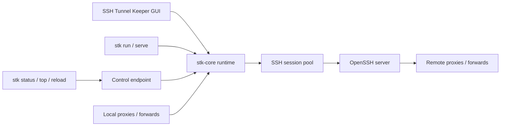

<p align="center">
  
</p>

<h1 align="center">SSH Tunnel Keeper</h1>

<p align="center">
  <strong>Reliable SSH proxies and tunnel management</strong><br>
  A cross-platform SSH proxy and tunnel manager built with Rust
</p>

<p align="center">
  English | <a href="README.zh-CN.md">简体中文</a>
</p>

SSH Tunnel Keeper, or **STK**, is a cross-platform SSH proxy and port forwarding application written in Rust. It implements the SSH client side directly and manages proxy listeners, SSH session pools, health probes, automatic recovery, runtime statistics, and a control API in one process. It does not depend on external `ssh -D/-L/-R` processes or a remote agent.

STK provides three components:

- `stk`: a CLI for terminals, scripts, and system services.
- SSH Tunnel Keeper GUI: a Dioxus-based desktop management application.
- `stk-core`: the shared SSH runtime embedded by both the CLI and GUI.

> [!IMPORTANT]
> STK is currently an early-stage release. The core proxy and forwarding features are functional, but you should validate the target platform, sshd policy, host key policy, and recovery behavior before using it for production traffic.

## Features

- Local SOCKS5h, HTTP, or mixed dynamic proxies, equivalent to `ssh -D`.
- Local fixed-target forwarding, equivalent to `ssh -L`.
- Remote dynamic proxies, equivalent to `ssh -R` without a fixed target.
- Remote fixed-target forwarding, equivalent to `ssh -R remote:local`.
- OpenSSH config support for aliases, authentication, known_hosts, `ProxyJump`, `ProxyCommand`, and forwarding directives.
- Multiple SSH sessions per host, selected by RTT, capacity, and health.
- SSH keepalive, active probes, link quality tracking, warm replacements, and automatic reconnects.
- Persistent tunnel status and backoff recovery after local bind or remote registration failures.
- Fully independent GUI, foreground CLI, and daemon-style runtime modes.
- Control API over Unix Domain Socket, Windows Named Pipe, or TCP.
- Server-side rate, traffic, latency, and error statistics for the global runtime, hosts, sessions, tunnels, and connections.
- 250 ms sampling, a trailing one-second rate window, immediate change notifications, and a one-second stable heartbeat.
- Up to 24 hours of minute-level traffic history, with an interactive one-hour overview in the GUI.
- Opt-in connection capture with a browser Network-style page, manual clearing, and optional terminal-state cleanup.
- YAML, JSON, and TOML configuration with native file-system notification based reloads.
- Linux, Windows, and macOS support.

STK is focused exclusively on SSH. It does not implement VMess, VLESS, Trojan, or Clash configuration compatibility.

## Architecture



The GUI and CLI do not depend on each other. The GUI first attempts to attach to the configured control endpoint and starts its own runtime only when no existing endpoint is available. `stk run` and `stk serve` start a runtime directly. Exclusive control endpoint binding prevents the same configuration from starting duplicate listeners.

## Installation

### GitHub Releases

Release assets include self-contained GUI packages and separate CLI archives:

| Platform | Archive | Contents |
| --- | --- | --- |
| Linux x86_64 GUI | `ssh-tunnel-keeper-vX.Y.Z-linux-x86_64.AppImage` | Portable GUI with GTK/WebKitGTK runtime libraries |
| Linux x86_64 CLI | `ssh-tunnel-keeper-vX.Y.Z-linux-x86_64-cli.tar.gz` | `stk`, systemd unit, and examples |
| Windows x86_64 | `ssh-tunnel-keeper-vX.Y.Z-windows-x86_64.zip` | `stk.exe`, `stk-gui.exe`, and examples |
| macOS universal GUI | `ssh-tunnel-keeper-vX.Y.Z-macos-universal.dmg` | Installable `SSH Tunnel Keeper.app` image |
| macOS universal CLI + GUI | `ssh-tunnel-keeper-vX.Y.Z-macos-universal.zip` | `stk`, `SSH Tunnel Keeper.app`, and examples |

Every release package has a matching `.sha256` file:

```bash
shasum -a 256 -c ssh-tunnel-keeper-vX.Y.Z-macos-universal.zip.sha256
shasum -a 256 -c ssh-tunnel-keeper-vX.Y.Z-macos-universal.dmg.sha256
sha256sum -c ssh-tunnel-keeper-vX.Y.Z-linux-x86_64.AppImage.sha256
sha256sum -c ssh-tunnel-keeper-vX.Y.Z-linux-x86_64-cli.tar.gz.sha256
```

The automated macOS release currently uses ad-hoc signing rather than Apple Developer ID signing and notarization. Gatekeeper may therefore display a warning on first launch. Developer ID signing and notarization should be added to the Release workflow before broad public distribution.

The Linux AppImage bundles the GTK and WebKitGTK runtime libraries used by the GUI. After downloading it:

```bash
chmod +x ssh-tunnel-keeper-vX.Y.Z-linux-x86_64.AppImage
./ssh-tunnel-keeper-vX.Y.Z-linux-x86_64.AppImage
```

The AppImage uses a statically linked runtime, so the host does not need to provide `libfuse.so.2`. Direct mounting still requires a usable `/dev/fuse` device and a `fusermount` or `fusermount3` helper. In containers or other restricted environments where FUSE mounting is unavailable, start the same package with `APPIMAGE_EXTRACT_AND_RUN=1 ./ssh-tunnel-keeper-vX.Y.Z-linux-x86_64.AppImage`.

Building the raw Linux GUI executable from source still requires the development packages:

```bash
sudo apt-get update
sudo apt-get install -y \
  libwebkit2gtk-4.1-dev libgtk-3-dev libayatana-appindicator3-dev \
  librsvg2-dev libxdo-dev
```

These GUI packages are not required when using only the `stk` CLI.

### Build From Source

STK requires Rust `1.95.0` or newer. The repository includes a pinned [`rust-toolchain.toml`](rust-toolchain.toml).

```bash
cd ssh-tunnel-keeper

cargo build --release -p stk-cli --locked
cargo build --manifest-path crates/stk-gui/Cargo.toml \
  --features desktop --release --locked
```

Build outputs:

- Linux/macOS CLI: `target/release/stk`
- Windows CLI: `target/release/stk.exe`
- Linux GUI: `crates/stk-gui/target/release/stk-gui`
- Windows GUI: `crates/stk-gui/target/release/stk-gui.exe`

On Linux, package the release binaries as an AppImage with:

```bash
sudo apt-get install -y desktop-file-utils patchelf pkg-config
./scripts/build-linux-appimage.sh
```

On macOS, use the packaging script to create a standard `.app` bundle instead of opening the raw executable from Finder:

```bash
./scripts/build-macos-app.sh
open "crates/stk-gui/target/release/bundle/macos/SSH Tunnel Keeper.app"
```

Create a local DMG from the application bundle:

```bash
./scripts/create-macos-dmg.sh \
  "crates/stk-gui/target/release/bundle/macos/SSH Tunnel Keeper.app" \
  "dist/ssh-tunnel-keeper-local.dmg"
```

## Quick Start

### 1. Configure OpenSSH

STK reads `~/.ssh/config` by default. The following `DynamicForward` and `LocalForward` entries are inherited automatically:

```sshconfig
Host my-server
    HostName ssh.example.com
    User alice
    IdentityFile ~/.ssh/id_ed25519
    ServerAliveInterval 30
    ServerAliveCountMax 3
    DynamicForward 127.0.0.1:17890
    LocalForward 127.0.0.1:15432 database.internal:5432
```

### 2. Create an STK Configuration

Create `~/.config/stk/config.yaml`:

```yaml
hosts:
  main:
    ssh-config-host: my-server
```

When `ssh-config-host` is set, STK loads the matching connection options and TCP forwarding directives. An inherited `DynamicForward` uses mixed mode by default, accepting both SOCKS5h and HTTP proxy requests.

You can also configure the SSH destination and forwarding rules entirely in STK:

```yaml
hosts:
  main:
    host: ssh.example.com
    username: alice
    auth:
      method: agent
    local-proxies:
      - listen: 127.0.0.1:17890
        mixed: true
```

### 3. Validate and Run

```bash
stk check
stk run
```

The GUI can run independently and does not require a daemon to be started first. For systemd, launchd, or Windows Service Manager deployments, use:

```bash
stk serve --config /etc/stk/config.yaml
```

`serve` does not fork or detach itself. Process lifetime, logs, and restart policy should be managed by the platform service manager. A Linux example is available at [`packaging/systemd/stk.service`](packaging/systemd/stk.service).

### 4. Test the Proxy

```bash
curl --socks5-hostname 127.0.0.1:17890 https://api.ipify.org
curl --proxy http://127.0.0.1:17890 https://api.ipify.org
```

`--socks5-hostname` sends the destination hostname through the SSH path for remote resolution instead of resolving it through local DNS.

## Forwarding Modes

| Configuration | SSH equivalent | Where `listen` exists | Where `target` is reached |
| --- | --- | --- | --- |
| `local-proxies` | `ssh -D` | STK machine | Dynamically selected by SOCKS5h/HTTP and reached through the SSH server |
| `local-forwards` | `ssh -L` | STK machine | From the SSH server side |
| `remote-proxies` | Dynamic `ssh -R` | SSH server | Dynamically selected by SOCKS5h/HTTP and reached from the STK machine |
| `remote-forwards` | `ssh -R remote:local` | SSH server | From the STK machine |

Complete example:

```yaml
hosts:
  production:
    ssh-config-host: production-server

    local-proxies:
      - listen: 127.0.0.1:17890
        mixed: true

    local-forwards:
      - listen: 127.0.0.1:15432
        target: database.internal:5432

    remote-proxies:
      - listen: 127.0.0.1:1080
        mixed: true

    remote-forwards:
      - listen: 127.0.0.1:18080
        target: 127.0.0.1:8080
```

`listen` and `target` accept domain names, IPv4 addresses, and bracketed IPv6 addresses such as `"[::1]:17890"`. Binding to `0.0.0.0`, `[::]`, or a non-loopback remote address expands the exposure boundary and should be combined with firewall rules and an appropriate sshd `GatewayPorts` policy.

## Configuration

STK supports YAML, JSON, and TOML, selected by the file extension. Examples are available in:

- [`examples/basic.yaml`](examples/basic.yaml)
- [`examples/basic.json`](examples/basic.json)
- [`examples/basic.toml`](examples/basic.toml)
- [`examples/ssh-native.yaml`](examples/ssh-native.yaml)
- [`examples/ssh-native.json`](examples/ssh-native.json)
- [`examples/ssh-native.toml`](examples/ssh-native.toml)

Generate a default configuration:

```bash
stk print-default-config --format yaml
stk print-default-config --format json
stk print-default-config --format toml
```

### Default Paths

| Entry point | Unix | Windows |
| --- | --- | --- |
| GUI, `stk run`, and `stk check` | `~/.config/stk` | `%USERPROFILE%/.config/stk` |
| `stk serve` | `/etc/stk` | `%PROGRAMDATA%/stk` |

STK searches a configuration directory for `config.yaml`, `config.yml`, `config.json`, and `config.toml`, in that order. Every related command accepts `--config` with either a file or an existing directory.

GUI preferences are stored in `~/.config/stk/gui-config.yaml`. The default log file is `~/.config/stk/stk.log`.

### Defaults and Overrides

Hosts and all forwarding entries use `auto: true` by default. Session, probe, and recovery settings also have built-in defaults, so the smallest useful configuration generally needs only `ssh-config-host`.

Use `override-default` for shared defaults:

```yaml
override-default:
  min-sessions: 1
  max-sessions: 3
  session-rotation-enabled: true
  session-rotation-interval-secs: 3600
  keep-alive-secs: 15
  probe:
    interval-secs: 5
  proxy:
    mixed: true

hosts:
  production:
    ssh-config-host: prod
    min-sessions: 2
  staging:
    ssh-config-host: staging
```

Precedence is:

```text
built-in defaults < override-default < explicit host or forwarding values
```

### OpenSSH Forward Inheritance

When `ssh-config-host` is configured, STK inherits these directives by default:

- `DynamicForward` -> `local-proxies`, using mixed mode.
- `LocalForward` -> `local-forwards`.
- `RemoteForward` with a target -> `remote-forwards`.
- `RemoteForward` without a target -> `remote-proxies`, using mixed mode.

An explicit STK entry with the same listening port takes precedence, including entries with `auto: false`. Disable all inherited forwarding for one host with:

```yaml
hosts:
  production:
    ssh-config-host: prod
    inherit-ssh-config-forwards: false
```

Current OpenSSH config support includes `Host`, `Include`, `ProxyJump`, `ProxyCommand`, authentication, known_hosts, keepalive, and TCP forwarding directives. OpenSSH `Match` blocks, ControlMaster sockets, and Unix socket forwarding are not currently supported.

### Dynamic Reload

The GUI, `stk run`, and `stk serve` monitor configuration changes through native file-system notifications: inotify on Linux, FSEvents on macOS, and `ReadDirectoryChangesW` on Windows. Consecutive events are debounced for approximately 300 ms before a new configuration generation is applied.

- A parse, validation, or startup failure keeps the previous valid generation active.
- Listeners are released and rebound during generation replacement, so new connections may briefly fail.
- Comment-only or whitespace-only changes do not restart the runtime.
- Editing `~/.ssh/config` alone does not trigger an automatic reload.
- The GUI Reload button and `stk reload` force STK and OpenSSH configuration to be read again.

## Restricting the SSH Server to Forwarding Only

STK needs SSH authentication and TCP forwarding, but it does not need a remote shell, PTY, SCP, or SFTP. A dedicated SSH user or group can therefore be restricted to forwarding-only access with an sshd `Match` block.

The following example applies the policy to the `stk-tunnel` group:

```sshdconfig
Match Group stk-tunnel
    AuthenticationMethods publickey
    PubkeyAuthentication yes
    PasswordAuthentication no
    KbdInteractiveAuthentication no

    PermitTTY no
    MaxSessions 0
    X11Forwarding no
    AllowAgentForwarding no
    AllowStreamLocalForwarding no
    PermitTunnel no
    PermitUserRC no

    AllowTcpForwarding yes
    GatewayPorts no
    PermitOpen any
    PermitListen 127.0.0.1:* [::1]:*
```

The key directive is `MaxSessions 0`. OpenSSH defines this as preventing all shell, login, and subsystem sessions while still permitting forwarding. This blocks interactive shells, PTYs, SFTP, modern SCP using the SFTP subsystem, and legacy SCP using a remote command. STK continues to work because it uses `direct-tcpip`, `forwarded-tcpip`, and SSH keepalive rather than shell or subsystem channels.

To match one account instead of a group, use:

```sshdconfig
Match User stk
```

The forwarding policy can be narrowed further:

- For only local proxies and `local-forwards`, use `AllowTcpForwarding local` and `PermitListen none`.
- For only `remote-proxies` and `remote-forwards`, use `AllowTcpForwarding remote` and `PermitOpen none`.
- `PermitOpen database.internal:5432 cache.internal:6379` limits destinations reachable through local forwarding. Keep `PermitOpen any` only when a dynamic SOCKS/HTTP proxy must reach arbitrary destinations.
- `PermitListen 127.0.0.1:* [::1]:*` restricts remote listeners to loopback. To expose remote ports externally, allow only explicit addresses and ports, then configure `GatewayPorts clientspecified`, firewall rules, and access control deliberately.
- `PermitTunnel no` disables OpenSSH TUN/TAP device forwarding, not the TCP forwarding used by STK.

Validate the server configuration before reloading sshd:

```bash
sudo sshd -t
sudo systemctl reload sshd
```

The service may be named `ssh` on some distributions. You can also inspect the effective `Match` result with `sshd -T -C user=stk,host=localhost,addr=127.0.0.1`. Do not set `DisableForwarding yes`, because it overrides and disables the TCP forwarding required by STK. If global directives follow the `Match` block in the same file, add `Match all` before returning to global configuration.

## CLI and Control API

Running `stk` without a subcommand prints help:

```text
stk serve                 # Long-running runtime managed by a service manager
stk run                   # Foreground user runtime
stk check                 # Validate configuration
stk status                # Print the current hierarchical status
stk top                   # Continuously display server-pushed status
stk reload                # Force a configuration reload
stk print-default-config  # Generate a minimal default configuration
```

Common management commands:

```bash
stk status
stk top
stk reload

stk status --system
stk status --config /path/to/config.toml
stk status --endpoint tcp:127.0.0.1:19090
stk status --json
```

The control endpoint can be configured explicitly:

```yaml
control:
  endpoint: unix:~/.config/stk/control.sock
```

Supported endpoint forms:

- `unix:/path/to/control.sock`: Unix Domain Socket on macOS or Linux.
- `pipe:stk-custom`: Windows Named Pipe.
- `tcp:19090`: shorthand for `tcp:127.0.0.1:19090`.
- `tcp:host:port`: an explicit TCP address, including non-loopback addresses.

Without an explicit endpoint, a user runtime uses `~/.config/stk/control.sock` or `\\.\pipe\stk-<USERNAME>`. A system runtime uses `/run/stk/control.sock`, `/var/run/stk/control.sock`, or `\\.\pipe\stk-system`.

HTTP endpoints include:

- `GET /v1/status`
- `GET /v1/status/stream`
- `GET /v1/traffic-history`
- `POST /v1/reload`
- `POST /v1/connections/capture/start`
- `POST /v1/connections/capture/stop`
- `DELETE /v1/connections`
- `POST /v1/connections/auto-clear/enable`
- `POST /v1/connections/auto-clear/disable`

Unix socket example:

```bash
curl --unix-socket ~/.config/stk/control.sock http://localhost/v1/status
curl --no-buffer --unix-socket ~/.config/stk/control.sock \
  http://localhost/v1/status/stream
curl --unix-socket ~/.config/stk/control.sock -X POST \
  http://localhost/v1/reload
```

> [!WARNING]
> The TCP control endpoint currently has no authentication or TLS. Do not bind it to a non-loopback address unless an external firewall, VPN, or SSH forwarding layer already protects access.

## GUI

The desktop application provides:

- Current trailing one-second upload and download rates and cumulative traffic.
- An interactive one-hour speed chart with two-minute points, a cursor crosshair, and tooltips.
- Hierarchical global, host, session, and tunnel status.
- Session creation time, establishment time, startup latency, RTT, channels, traffic, and errors.
- Tunnel listening state, owner session, connections, traffic, retry state, and failure reason.
- An opt-in Network-style connection capture page.
- Raw YAML/JSON/TOML editing, validation, saving, and reload.
- English and Simplified Chinese UI languages.
- A launch-at-login switch backed by a user-level system startup item.
- Tray throughput display, with the runtime continuing after the main window is closed.

On macOS, the application appears in the Dock and Cmd+Tab while its main window is visible. Closing the window switches it to accessory mode and leaves only the menu bar icon. The Windows GUI uses the Windows subsystem and does not open an extra console window.

Enabling launch at login creates a LaunchAgent on macOS, an `HKCU` Run entry on Windows, or an XDG Autostart entry on Linux. Automatic startup uses the default user configuration and starts directly in the tray without opening the main window.

## Reliability and Statistics

Each SSH host maintains a session pool. New channels are scheduled using session RTT, active channel count, capacity, and health. When a probe approaches the failure threshold, the runtime creates a replacement before preventing the suspect session from accepting new channels and allowing existing channels to drain.

The built-in pool defaults are three active sessions and a maximum of ten. Both values can be changed with `min-sessions` and `max-sessions` under `override-default` or an individual host. Scheduled session rotation is enabled by default and rotates one oldest healthy session per host every hour. Rotation is staggered: STK first uses spare pool capacity to establish a replacement, then stops assigning new channels to the selected session and removes it from runtime status after its existing channels drain. Set `session-rotation-enabled: false` to disable this behavior, or change `session-rotation-interval-secs`. Proactive replacement waits when `max-sessions` does not leave spare capacity.

Remote forwarding uses one owner session with warm standby sessions. When the owner becomes unreliable, STK releases the old remote listener and registers it through a healthy standby. Existing channels on the previous SSH session continue to use that session, while new connections move to the new owner.

A local listener bind failure does not stop the entire runtime. The failed entry remains visible as `listen-failed` and retries with exponential backoff. Remote registration failures are also retried by the owner-session management loop.

Statistics are calculated inside `stk-core`:

- Traffic is sampled every 250 ms.
- Every `/s` value represents a trailing one-second window rather than a 250 ms instantaneous value.
- Stable status is pushed once per second, with immediate pushes after material traffic changes.
- Rate and traffic totals are available at the global, host, session, tunnel, and connection levels.
- History uses one-minute buckets and retains up to 1440 buckets, or 24 hours, in memory.
- The GUI overview reads the latest 60 one-minute buckets and aggregates them into 30 two-minute points.
- Historical and cumulative runtime values restart when the runtime process restarts.

Proxy and forwarding logs use a unique `connection_id` and include latency for protocol detection, proxy handshake, SSH channel opening, first client data, first upstream byte, and the relay lifetime.

## Development

Repository layout:

```text
crates/stk-core  SSH runtime, configuration, control API, and statistics
crates/stk-cli   stk command-line application
crates/stk-gui   Dioxus desktop application with its own Cargo.lock
examples         YAML, JSON, and TOML examples
packaging        Service manager files
scripts          Icon generation and macOS packaging scripts
```

Local checks:

```bash
cargo fmt --all -- --check
cargo clippy --workspace --all-targets --all-features --locked -- -D warnings
cargo test --workspace --all-targets --locked

cargo fmt --manifest-path crates/stk-gui/Cargo.toml -- --check
cargo clippy --manifest-path crates/stk-gui/Cargo.toml \
  --features desktop --all-targets --locked -- -D warnings
cargo test --manifest-path crates/stk-gui/Cargo.toml \
  --features desktop --locked
```

Regenerate all platform icon resources after changing the SVG sources:

```bash
./scripts/generate-icons.sh
```

## CI and Releases

- [`.github/workflows/ci.yml`](.github/workflows/ci.yml) runs formatting, Clippy, tests, Linux/macOS/Windows release builds, a Linux AppImage execution check, and a macOS DMG packaging check on pushes and pull requests.
- [`.github/workflows/release.yml`](.github/workflows/release.yml) builds the Linux AppImage, platform CLI archives, and universal macOS DMG, generates SHA-256 files, and creates a GitHub Release for a pushed `v*` tag.
- [`.github/release.yml`](.github/release.yml) configures categories for GitHub-generated release notes.

Before publishing a version, update:

1. `[workspace.package].version` in the root `Cargo.toml`.
2. `version` in `crates/stk-gui/Cargo.toml`.
3. `CFBundleShortVersionString` in `crates/stk-gui/macos/Info.plist`.
4. Both Cargo lock files.

Then create and push the tag:

```bash
git tag -a v0.1.0 -m "SSH Tunnel Keeper v0.1.0"
git push origin v0.1.0
```

The Release workflow rejects a tag that does not match the Cargo and Info.plist versions.

## Security Notes

- Prefer `host-key-policy: known-hosts`; do not bypass host key verification on untrusted networks.
- Bind SOCKS/HTTP listeners and remote forwards to loopback unless wider exposure is explicitly required.
- The TCP control endpoint has no authentication or encryption; prefer a Unix socket or Named Pipe.
- `remote-proxies` allow a listener on the SSH server to reach networks accessible from the STK machine, so define the access boundary carefully.
- Logs may contain target addresses, listener addresses, and error context. Redact them before sharing.
- Use a forwarding-only sshd user or group as described above when remote shell access is not required.

## License

Licensed under either of:

- Apache License, Version 2.0
- MIT License

at your option.
