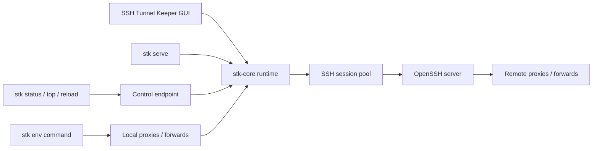

<p align="center">
  
</p>

<h1 align="center">SSH Tunnel Keeper</h1>

<p align="center">
  <strong>Reliable SSH proxies and tunnel management</strong><br>
  可靠的 SSH 代理与隧道助手
</p>

<p align="center">
  简体中文 | <a href="README.md">English</a>
</p>

SSH Tunnel Keeper，简称 **STK**，是一个使用 Rust 构建的跨平台 SSH 代理和端口转发工具。它直接实现 SSH client 协议能力，在一个进程内维护代理 listener、SSH session pool、健康探测、自动恢复、实时统计和控制接口，不依赖外部 `ssh -D/-L/-R` 进程或远端 agent。

STK 同时提供：

- `stk`：适合终端、脚本和系统服务的 CLI。
- SSH Tunnel Keeper GUI：基于 Dioxus 的桌面管理应用。
- `stk-core`：由 CLI 和 GUI 共同使用的 SSH runtime。

> [!IMPORTANT]
> 项目当前处于早期发布阶段。核心代理和隧道功能已经可用，但在用于生产网络前，请先验证目标平台、sshd 配置、主机密钥策略和故障恢复行为。

## 功能

- 本地 SOCKS5h、HTTP 或 mixed 动态代理，等同于 `ssh -D`。
- 本地固定目标转发，等同于 `ssh -L`。
- 远端动态代理，等同于没有固定 target 的 `ssh -R`。
- 远端固定目标转发，等同于 `ssh -R remote:local`。
- 从 `~/.ssh/config` 读取 Host alias、认证、known_hosts、`ProxyJump`、`ProxyCommand` 和 forward。
- 每个 host 维护多条 SSH session，按 RTT、容量和健康状态选择链路。
- SSH keepalive、主动探针、链路质量统计、预热 replacement 和断线自动恢复。
- listener 绑定失败或远端注册失败时保留 tunnel 状态，并持续退避重试。
- GUI、CLI 前台模式和 daemon 模式都可以独立运行完整 runtime。
- Unix Domain Socket、Windows Named Pipe 或 TCP 控制接口。
- 服务端统一统计全局、host、session、tunnel 和 connection 的实时速度、流量与延迟。
- 250 ms 采样、最近 1 秒滚动速率、状态变化即时推送和 1 秒稳定心跳。
- 最近 24 小时分钟级流量历史；GUI 概览展示最近 1 小时交互曲线。
- 类似浏览器 Network 面板的按需连接捕获、清理和终态连接自动清理。
- YAML、JSON、TOML 配置，以及基于文件系统通知的动态加载。
- Linux、Windows 和 macOS 支持。

STK 专注于 SSH，不提供 VMess、VLESS、Trojan 或 Clash 配置兼容层。

## 架构



GUI 与 CLI 不存在启动依赖。GUI 会先尝试附着到配置对应的 control endpoint，endpoint 不存在时才在自己的进程内启动 runtime；`stk serve` 会直接启动 runtime。相同 endpoint 的独占绑定可以防止同一份配置重复启动 listener。

## 安装

### GitHub Releases

Release 提供自包含的 GUI 软件包和独立的 CLI 归档：

| 平台 | 归档 | 内容 |
| --- | --- | --- |
| Linux x86_64 GUI | `stk-vX.Y.Z-linux-x86_64.appimage` | 包含 GTK/WebKitGTK 运行库的便携 GUI |
| Linux aarch64 GUI | `stk-vX.Y.Z-linux-aarch64.appimage` | 包含 GTK/WebKitGTK 运行库的 ARM64 便携 GUI |
| Linux x86_64 CLI | `stk-vX.Y.Z-linux-x86_64-musl.tar.gz` | 静态链接的 musl `stk`、systemd unit、样例配置 |
| Linux aarch64 CLI | `stk-vX.Y.Z-linux-aarch64-musl.tar.gz` | 静态链接的 musl `stk`、systemd unit、样例配置 |
| Windows x86_64 | `stk-vX.Y.Z-windows-x86_64.zip` | `stk.exe`、`stk-gui.exe`、样例配置 |
| Windows aarch64 | `stk-vX.Y.Z-windows-aarch64.zip` | ARM64 `stk.exe`、`stk-gui.exe`、样例配置 |
| macOS universal GUI | `stk-vX.Y.Z-macos-universal.dmg` | 可安装的 `SSH Tunnel Keeper.app` 镜像 |
| macOS universal CLI + GUI | `stk-vX.Y.Z-macos-universal.zip` | `stk`、`SSH Tunnel Keeper.app`、样例配置 |

每个 Release 都包含一个覆盖全部上传产物的 `stk-vX.Y.Z-sha256sums.txt` 文件。下载所需产物和校验文件后，可以验证本地已有的文件：

```bash
sha256sum --ignore-missing --check stk-v*-sha256sums.txt
```

当前自动发布的 macOS 应用使用 ad-hoc 签名，尚未使用 Apple Developer ID 公证，因此首次运行可能出现 Gatekeeper 提示。正式分发前应在 Release workflow 中接入 Developer ID 签名和 notarization。

两个 Linux CLI 归档中的 `stk` 都是没有动态库依赖的 musl 静态可执行文件，不依赖宿主机的 glibc 版本：

```bash
tar -xzf stk-v*-linux-x86_64-musl.tar.gz
./stk-v*-linux-x86_64-musl/stk --help
```

Linux GUI AppImage 会捆绑应用使用的 GTK 和 WebKitGTK 运行库，但 GUI 本身并不是完全静态链接的可执行文件。下载后执行：

```bash
chmod +x stk-v*-linux-x86_64.appimage
./stk-v*-linux-x86_64.appimage
```

AppImage 使用静态链接的 type-2 runtime，因此宿主机不需要提供 `libfuse.so.2`。直接挂载仍需要可用的 `/dev/fuse` 设备以及 `fusermount` 或 `fusermount3` 辅助程序；在容器或其他不能使用 FUSE 挂载的受限环境中，使用提取运行模式：

```bash
APPIMAGE_EXTRACT_AND_RUN=1 ./stk-v*-linux-x86_64.appimage
```

从源码构建裸 Linux GUI 可执行文件时仍然需要安装开发包：

```bash
sudo apt-get update
sudo apt-get install -y \
  libwebkit2gtk-4.1-dev libgtk-3-dev libayatana-appindicator3-dev \
  librsvg2-dev libxdo-dev
```

只使用 `stk` CLI 时不需要这些 GUI 包。

### 从源码构建

项目要求 Rust `1.95.0` 或更高版本。

```bash
rustup toolchain install 1.95.0 --component rustfmt,clippy
cd ssh-tunnel-keeper

cargo build --release -p stk-cli --locked
cargo build --manifest-path crates/stk-gui/Cargo.toml \
  --features desktop --release --locked
```

构建结果：

- Linux/macOS CLI：`target/release/stk`
- Windows CLI：`target/release/stk.exe`
- Linux GUI：`crates/stk-gui/target/release/stk-gui`
- Windows GUI：`crates/stk-gui/target/release/stk-gui.exe`

在 Linux 上可以用下面的命令把 release 二进制打包为 AppImage：

```bash
sudo apt-get install -y desktop-file-utils file patchelf pkg-config
./scripts/build-linux-appimage.sh
```

macOS 请使用脚本生成标准 `.app`，不要在 Finder 中直接双击裸可执行文件：

```bash
./scripts/build-macos-app.sh
open "crates/stk-gui/target/release/bundle/macos/SSH Tunnel Keeper.app"
```

从应用包生成本地 DMG：

```bash
./scripts/create-macos-dmg.sh \
  "crates/stk-gui/target/release/bundle/macos/SSH Tunnel Keeper.app" \
  "dist/ssh-tunnel-keeper-local.dmg"
```

## 快速开始

### 1. 准备 OpenSSH 配置

STK 默认读取 `~/.ssh/config`。下面的 `DynamicForward` 和 `LocalForward` 会被 STK 自动继承：

```sshconfig
Host my-server
    HostName ssh.example.com
    User alice
    IdentityFile ~/.ssh/id_ed25519
    ServerAliveInterval 30
    ServerAliveCountMax 3
    DynamicForward 127.0.0.1:17890
    LocalForward 127.0.0.1:15432 database.internal:5432
```

### 2. 创建 STK 配置

创建 `~/.config/stk/config.yaml`：

```yaml
hosts:
  main:
    ssh-config-host: my-server
```

只要设置 `ssh-config-host`，STK 默认就会加载该 alias 的连接参数和 TCP forward。继承的 `DynamicForward` 使用 mixed 模式，同时接受 SOCKS5h 和 HTTP 代理请求。

也可以完全在 STK 中显式配置：

```yaml
hosts:
  main:
    host: ssh.example.com
    username: alice
    auth:
      method: agent
    local-proxies:
      - listen: 127.0.0.1:17890
        mixed: true
```

### 3. 校验并运行

```bash
stk check
stk serve
```

也可以启动 GUI，GUI 不要求先运行 daemon。需要交给 systemd、launchd 或 Windows Service Manager 托管时使用：

```bash
stk serve --system --config /etc/stk/config.yaml
```

`serve` 不会自行 fork；进程生命周期、日志和重启应交给服务管理器。Linux systemd 样例位于 [`packaging/systemd/stk.service`](packaging/systemd/stk.service)。

### 4. 测试代理

```bash
curl --socks5-hostname 127.0.0.1:17890 https://api.ipify.org
curl --proxy http://127.0.0.1:17890 https://api.ipify.org
```

`--socks5-hostname` 会让目标域名经 SSH 远端解析，避免本地 DNS 泄漏。

### 让命令使用配置中的代理

`stk env` 会选择一个已启用的本地代理，注入对应的代理环境变量，然后直接执行命令，不经过 shell：

```bash
stk env curl https://api.ipify.org
stk env -p production curl https://api.ipify.org
stk env -p production/mixed-ssh@socks5h curl https://api.ipify.org
stk env -p production -s http curl https://api.ipify.org
```

可以在配置中定义简短且可复用的 profile：

```yaml
env:
  default: production
  inject: [all-proxy, http-proxy, https-proxy]
  inherit: []
  profiles:
    production:
      host: production
      tunnel: mixed-ssh
      scheme: http
      # profile 列表会完整覆盖对应的全局列表。
      inject: [all-proxy]
      inherit: [no-proxy]
```

不提供子命令时，`stk env` 会打印计算出的环境变量。增加 `--live` 后还会查询 control endpoint，只有所选 tunnel 当前处于 listening 状态才会继续。默认会选择第一个启用的 host 和 local proxy，也包括从 OpenSSH `DynamicForward` 继承的代理。mixed listener 默认使用 `http`，可以通过 `-s socks5h` 或 `-s socks5` 覆盖；只支持 SOCKS 的 listener 仍默认使用 `socks5h`。

选择优先级为：

```text
自动选择 < env.default < STK_PROXY_PROFILE < -p/--proxy < --host/--tunnel/--scheme
```

`inject` 和 `inherit` 用来控制传递给子进程的代理相关环境变量。可用变量组包括 `all-proxy`、`http-proxy` 和 `https-proxy`，`inherit` 还支持 `no-proxy`。每个变量组同时表示大小写形式，例如 `http-proxy` 同时对应 `HTTP_PROXY` 和 `http_proxy`。

未配置策略时，STK 默认不继承任何已有代理变量，将选中代理的 URL 同时注入大小写形式的 `ALL_PROXY`、`HTTP_PROXY` 和 `HTTPS_PROXY`，并清理 `NO_PROXY/no_proxy`。profile 可以分别完整覆盖全局的 `inject` 和 `inherit` 列表；profile 中省略某个列表时继续使用全局列表，显式配置空列表则禁用对应行为。同一个变量组同时出现在两个列表中时，注入优先。`PATH`、`HOME` 等普通进程环境变量仍会正常继承。`STK_PROXY_HOST`、`STK_PROXY_TUNNEL`、`STK_PROXY_SCHEME` 和 `STK_PROXY_URL` 始终会被设置。

## 四类转发

| 配置 | SSH 语义 | `listen` 所在位置 | `target` 所在位置 |
| --- | --- | --- | --- |
| `local-proxies` | `ssh -D` | STK 本机 | 由 SOCKS5h/HTTP 请求动态指定，经 SSH server 访问 |
| `local-forwards` | `ssh -L` | STK 本机 | SSH server 能访问的目标 |
| `remote-proxies` | 动态 `ssh -R` | SSH server | 由 SOCKS5h/HTTP 请求动态指定，从 STK 本机访问 |
| `remote-forwards` | `ssh -R remote:local` | SSH server | STK 本机能访问的目标 |

完整配置：

```yaml
hosts:
  production:
    ssh-config-host: production-server

    local-proxies:
      - listen: 127.0.0.1:17890
        mixed: true

    local-forwards:
      - listen: 127.0.0.1:15432
        target: database.internal:5432

    remote-proxies:
      - listen: 127.0.0.1:1080
        mixed: true

    remote-forwards:
      - listen: 127.0.0.1:18080
        target: 127.0.0.1:8080
```

`listen` 和 `target` 支持域名、IPv4 和带方括号的 IPv6，例如 `"[::1]:17890"`。监听 `0.0.0.0`、`[::]` 或远端非回环地址会扩大访问范围，应结合防火墙和 sshd `GatewayPorts` 配置使用。

## 配置

配置支持 YAML、JSON 和 TOML，根据扩展名解析。对应样例位于：

- [`examples/basic.yaml`](examples/basic.yaml)
- [`examples/basic.json`](examples/basic.json)
- [`examples/basic.toml`](examples/basic.toml)
- [`examples/ssh-native.yaml`](examples/ssh-native.yaml)
- [`examples/ssh-native.json`](examples/ssh-native.json)
- [`examples/ssh-native.toml`](examples/ssh-native.toml)

生成默认配置：

```bash
stk print-default-config --format yaml
stk print-default-config --format json
stk print-default-config --format toml
```

### 默认路径

| 入口 | Unix | Windows |
| --- | --- | --- |
| GUI、`stk serve`、`stk env`、`stk check` | `~/.config/stk` | `%USERPROFILE%/.config/stk` |
| `stk serve --system` 和带 `--system` 的控制命令 | `/etc/stk` | `%PROGRAMDATA%/stk` |

目录中依次查找 `config.yaml`、`config.yml`、`config.json` 和 `config.toml`。所有相关命令都可以通过 `--config` 指定文件或已有目录。

GUI 自身设置保存在 `~/.config/stk/gui-config.yaml`，日志默认写入 `~/.config/stk/stk.log`。

### 默认值覆盖

host 和所有转发项的 `auto` 默认为 `true`。其他 session、探针和恢复参数也提供代码默认值，最小配置通常只需要 `ssh-config-host`。

全局默认值使用 `override-default`：

```yaml
override-default:
  min-sessions: 1
  max-sessions: 3
  session-rotation-enabled: true
  session-rotation-interval-secs: 3600
  keep-alive-secs: 15
  probe:
    interval-secs: 5
  proxy:
    mixed: true

hosts:
  production:
    ssh-config-host: prod
    min-sessions: 2
  staging:
    ssh-config-host: staging
```

优先级为：

```text
代码默认值 < override-default < host 或转发项显式值
```

### OpenSSH forward 继承

设置 `ssh-config-host` 后，STK 默认继承：

- `DynamicForward` -> `local-proxies`，默认 mixed。
- `LocalForward` -> `local-forwards`。
- 带 target 的 `RemoteForward` -> `remote-forwards`。
- 不带 target 的 `RemoteForward` -> `remote-proxies`，默认 mixed。

STK 配置中显式声明的相同监听端口优先，包括 `auto: false`。完全禁用某个 host 的继承：

```yaml
hosts:
  production:
    ssh-config-host: prod
    inherit-ssh-config-forwards: false
```

当前支持 `Host`、`Include`、`ProxyJump`、`ProxyCommand`、认证、known_hosts、keepalive 和 TCP forward。暂不支持 OpenSSH `Match` 条件块、ControlMaster socket 和 Unix socket forward。

### 动态加载

GUI 和 `stk serve` 使用原生文件系统通知监听配置：Linux 使用 inotify，macOS 使用 FSEvents，Windows 使用 `ReadDirectoryChangesW`。连续事件会经过约 300 ms 合并，再以新 generation 应用。

- 新配置解析或启动失败时继续使用上一份有效 generation。
- listener 会短暂释放并重新绑定，新连接在切换期间可能失败。
- 只修改注释或空白不会重启 runtime。
- 修改 `~/.ssh/config` 本身不会自动触发 reload。
- GUI 的 Reload 按钮或 `stk reload` 会强制重新读取 STK 和 OpenSSH 配置。

## SSH Server 限权配置

STK 只需要 SSH 认证和 TCP forwarding，不需要远端 shell、PTY、SCP 或 SFTP。可以在 SSH server 上为专用用户或用户组设置 `Match` 规则，将账号限制为只能建立隧道。

下面以 `stk-tunnel` 用户组为例：

```sshdconfig
Match Group stk-tunnel
    AuthenticationMethods publickey
    PubkeyAuthentication yes
    PasswordAuthentication no
    KbdInteractiveAuthentication no

    PermitTTY no
    MaxSessions 0
    X11Forwarding no
    AllowAgentForwarding no
    AllowStreamLocalForwarding no
    PermitTunnel no
    PermitUserRC no

    AllowTcpForwarding yes
    GatewayPorts no
    PermitOpen any
    PermitListen 127.0.0.1:* [::1]:*
```

其中最关键的是 `MaxSessions 0`。OpenSSH 对它的定义是：禁止所有 shell、login 和 subsystem session，同时继续允许 forwarding。因此交互式 shell、PTY、现代 SFTP 模式的 SCP、SFTP subsystem，以及旧版基于远端命令的 SCP 都无法建立，但 STK 使用的 `direct-tcpip`、`forwarded-tcpip` 和 keepalive 不受影响。

可以将第一行改成只匹配一个用户：

```sshdconfig
Match User stk
```

根据实际用途继续收紧 forwarding：

- 只允许本地 proxy 和 `local-forwards` 时使用 `AllowTcpForwarding local`，并设置 `PermitListen none`。
- 只允许 `remote-proxies` 和 `remote-forwards` 时使用 `AllowTcpForwarding remote`，并设置 `PermitOpen none`。
- `PermitOpen database.internal:5432 cache.internal:6379` 可以限制本地 forwarding 能访问的目标；动态 SOCKS/HTTP 代理需要访问任意目标时则保留 `PermitOpen any`。
- `PermitListen 127.0.0.1:* [::1]:*` 将远端监听限制在回环地址。需要对外暴露远端端口时，应只开放明确地址和端口，并同时配置 `GatewayPorts clientspecified`、防火墙和访问控制。
- `PermitTunnel no` 禁止的是 OpenSSH TUN/TAP 设备转发，不会禁用 STK 使用的 TCP forwarding。

修改后应先检查配置，再平滑加载 sshd：

```bash
sudo sshd -t
sudo systemctl reload sshd
```

不同发行版的服务名称可能是 `ssh`。还可以使用 `sshd -T -C user=stk,host=localhost,addr=127.0.0.1` 检查 `Match` 后的最终配置。不要设置 `DisableForwarding yes`，否则它会覆盖并关闭 STK 所需的 TCP forwarding。如果同一文件中还要继续设置全局指令，应先使用 `Match all` 结束该匹配块。

## CLI 与控制接口

不带参数运行 `stk` 会显示帮助：

```text
stk serve                 # 前台用户 runtime；系统服务增加 --system
stk env [选项] 命令       # 为命令注入代理环境变量
stk check                 # 校验配置
stk status                # 输出当前分层状态
stk top                   # 持续显示服务端推送状态
stk reload                # 强制重新加载配置
stk print-default-config  # 生成最小默认配置
```

常用管理命令：

```bash
stk status
stk top
stk reload

stk status --system
stk status --config /path/to/config.toml
stk status --endpoint tcp:127.0.0.1:19090
stk status --json
```

control endpoint 可以放在配置中：

```yaml
control:
  endpoint: unix:~/.config/stk/control.sock
```

支持：

- `unix:/path/to/control.sock`：macOS/Linux Unix Domain Socket。
- `pipe:stk-custom`：Windows Named Pipe。
- `tcp:19090`：`tcp:127.0.0.1:19090` 的简写。
- `tcp:host:port`：指定 TCP 地址，包括非回环地址。

未设置时，用户 runtime 默认使用 `~/.config/stk/control.sock` 或 `\\.\pipe\stk-<USERNAME>`；系统 runtime 默认使用 `/run/stk/control.sock`、`/var/run/stk/control.sock` 或 `\\.\pipe\stk-system`。

HTTP API 包括：

- `GET /v1/status`
- `GET /v1/status/stream`
- `GET /v1/traffic-history`
- `POST /v1/reload`
- `POST /v1/connections/capture/start`
- `POST /v1/connections/capture/stop`
- `DELETE /v1/connections`
- `POST /v1/connections/auto-clear/enable`
- `POST /v1/connections/auto-clear/disable`

Unix socket 示例：

```bash
curl --unix-socket ~/.config/stk/control.sock http://localhost/v1/status
curl --no-buffer --unix-socket ~/.config/stk/control.sock \
  http://localhost/v1/status/stream
curl --unix-socket ~/.config/stk/control.sock -X POST \
  http://localhost/v1/reload
```

> [!WARNING]
> TCP control endpoint 当前没有认证和 TLS。除非外部已有防火墙、VPN 或 SSH 转发保护，否则不要绑定到非回环地址。

## GUI

桌面应用提供：

- 当前一秒滚动上传/下载速度与累计流量。
- 最近一小时速度曲线，按两分钟展示，支持鼠标十字线和 tooltip。
- 全局、host、session 和 tunnel 分层状态。
- 每条 session 的创建时间、建立时间、启动耗时、RTT、channel、流量和错误。
- tunnel 监听状态、owner session、连接、流量、重试和错误原因。
- 默认关闭的 Network 风格连接捕获页面。
- YAML/JSON/TOML 原始配置编辑、校验、保存和 reload。
- 中文与英文切换。
- 使用当前用户系统启动项的“登录时自动启动”开关。
- 托盘实时吞吐，关闭窗口后 runtime 继续运行。

macOS 主窗口显示时会出现在 Dock 和 Cmd+Tab；关闭窗口后切换为 accessory 模式，只保留菜单栏图标。Windows GUI 使用 Windows subsystem，不会创建额外的终端窗口。

开启登录时自动启动后，macOS 会创建 LaunchAgent，Windows 会写入当前用户的 `HKCU` Run 项，Linux 会创建 XDG Autostart 项。系统自动启动使用默认用户配置，并直接进入托盘，不主动打开主窗口。

## 可靠性与统计

每个 SSH host 默认维持 session pool。新 channel 按 session RTT、活跃 channel、容量和健康状态调度；探针接近失败阈值时，runtime 会先创建 replacement，再让可疑 session 停止接收新 channel，并等待已有 channel 排空。

内置默认值为 3 条活跃 session、最多 10 条 session；这两个值都可以通过 `override-default` 或单个 host 下的 `min-sessions`、`max-sessions` 修改。定时轮转默认开启，每个 host 每小时只轮转一条最老的健康 session，因此多条 session 会交错更新。STK 会先利用池中的备用容量建立 replacement，再让被选中的 session 停止接收新 channel；已有 channel 排空后，该 session 会退出并从运行状态列表中移除。可以用 `session-rotation-enabled: false` 关闭，或通过 `session-rotation-interval-secs` 修改间隔。如果 `max-sessions` 没有留下备用容量，主动轮转会等待，不会先断开旧 session。

远端转发采用单 owner 加 warm standby。owner 不可靠时，STK 会释放旧 remote listener，并通过健康 standby 重新注册。没有远端 agent 时，已经建立在旧 SSH session 上的 channel 仍由原 session 处理，新的连接切换到新 owner。

本地 listener 绑定失败不会终止整个 runtime。失败项保留为 `listen-failed`，并使用指数退避重新绑定；远端 listener 注册失败也会由 owner-session 管理循环持续恢复。

统计由 `stk-core` 在 runtime 内完成：

- 250 ms 更新一次采样。
- `/s` 始终表示最近 1 秒滚动窗口，而不是 250 ms 瞬时值。
- 稳定状态每秒推送一次，明显变化时立即推送。
- 速率和流量覆盖 global、host、session、tunnel 和 connection。
- 历史按一分钟聚合，内存中最多保留 1440 个桶，也就是 24 小时。
- GUI 概览只读取最近 60 个一分钟桶，并聚合成 30 个两分钟点。
- runtime 重启后历史和累计统计重新开始。

代理和转发日志使用唯一 `connection_id`，并记录协议检测、代理握手、SSH channel 打开、首个客户端数据、首个上游字节和 relay 生命周期等延迟。

## 开发

Workspace 结构：

```text
crates/stk-core  SSH runtime、配置、控制接口和统计
crates/stk-cli   stk 命令行程序
crates/stk-gui   Dioxus 桌面应用，使用独立 Cargo.lock
examples         YAML、JSON、TOML 配置样例
packaging        系统服务文件
scripts          图标和 macOS 应用构建脚本
```

本地检查与测试：

```bash
cargo fmt --all -- --check
cargo clippy --workspace --all-targets --all-features --locked -- -D warnings
cargo test --workspace --all-targets --locked

cargo fmt --manifest-path crates/stk-gui/Cargo.toml -- --check
cargo clippy --manifest-path crates/stk-gui/Cargo.toml \
  --features desktop --all-targets --locked -- -D warnings
cargo test --manifest-path crates/stk-gui/Cargo.toml \
  --features desktop --locked
```

修改图标后重新生成所有平台资源：

```bash
./scripts/generate-icons.sh
```

## CI 与发布

- [`.github/workflows/ci.yml`](.github/workflows/ci.yml) 在 push 和 pull request 上执行格式、Clippy、测试、各平台 release build、x86_64/aarch64 musl 静态 CLI 检查、Ubuntu 22.04/24.04 与 Arch Linux AppImage 提取运行检查，以及 macOS DMG 打包检查。
- [`.github/workflows/release.yml`](.github/workflows/release.yml) 在推送 `v*` tag 时发布 x86_64/aarch64 Linux musl 静态 CLI 归档、x86_64/aarch64 Linux AppImage、x86_64/aarch64 Windows 产物、universal macOS 产物和带版本号的校验文件，并创建 GitHub Release。
- [`.github/release.yml`](.github/release.yml) 定义 GitHub 自动生成发布说明的分类。

发布版本前同步更新：

1. 根 `Cargo.toml` 的 `[workspace.package].version`。
2. `crates/stk-gui/Cargo.toml` 的 `version`。
3. `crates/stk-gui/macos/Info.plist` 的 `CFBundleShortVersionString`。
4. 两份 `Cargo.lock`。

然后创建并推送 tag：

```bash
git tag -a v0.1.0 -m "SSH Tunnel Keeper v0.1.0"
git push origin v0.1.0
```

Release workflow 会拒绝 tag 与 Cargo/Info.plist 版本不一致的发布。

## 安全说明

- 推荐使用 `host-key-policy: known-hosts`，不要在不可信网络中跳过主机密钥验证。
- SOCKS/HTTP listener 和 remote forward 默认应绑定回环地址。
- TCP control endpoint 没有认证和加密，默认只使用 Unix socket 或 Named Pipe。
- `remote-proxies` 会让 SSH server 上的 listener 通过 STK 本机访问目标网络，启用前应明确访问边界。
- 日志可能包含目标地址、监听地址和错误上下文，分享前请先脱敏。

## License

Licensed under either of:

- Apache License, Version 2.0
- MIT License

at your option.
